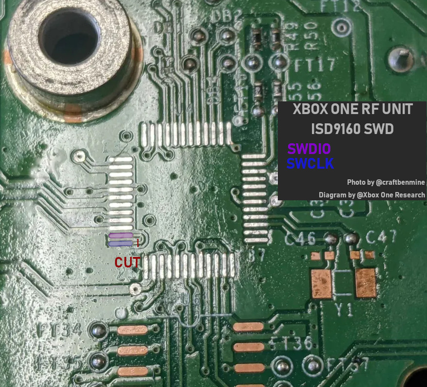

# ISD9160 - Component Stuffing Guide

This document details all components required to have custom audio functionality on Xbox One S/X and Series S/X non-limited-edition mainboards.
See [Initial flashing of ISD9160](#reading-and-writing-the-chip-via-swd) when you are using a fresh ISD9160 chip (not salvaged from a Xbox console).

## Xbox One S

On this console revision the ISD9160 circuitry is located on the RF Unit.
Speaker is connected via wires to the JST connector.

STL Models for a bracket (X360, possibly salvagable): <https://www.printables.com/model/189049-xbox-360-slim-speaker-clip>

> [!IMPORTANT]
> Is the pitch for speaker connector correct?

### Bill of Materials (BOM)

| Reference          | Qty | Package    | Value              | Component Type         |
| :----------------- | :-: | :--------- | :------------------| :--------------------- |
| U4                 |  1  | QFP48      | ISD9160            | Audio Codec IC         |
| R1                 |  1  | 0402       | 10 kΩ              | Resistor               |
| R29                |  1  | 0805       | 0  Ω               | Resistor               |
| C7, C20, C35, C36  |  4  | 0805       | 10 μF              | Capacitor              |
|                    |     |            |                    |                        |
| J1                 |  1  | JST        | S2B-PH-K-S(LF)(SN) | Speaker Connector      |
| Speaker            |  1  | ?          | ?                  | Speaker                |
| C9, R6, R7, R22    |  4  | /          | DNP                | Do not place           |

**TODO**: C2, C8, C11, C13, C15, C18, C30, C48 - 0402 - ?

**TODO**: Actual speaker with JST connector


## Xbox One X

On this console revision the ISD9160 circuitry is located on the motherboard.
Speaker is soldered onto the mainboard.

### Bill of Materials (BOM)

| Reference          | Qty | Package    | Value                    | Component Type         | Note                       |
| :----------------- | :-: | :--------- | :---------------         | :--------------------- | :------------------------- |
| U43                |  1  | QFP48      | ISD9160                  | Audio Codec IC         |                            |
| R499               |  1  | 0402       | 10  kΩ                   | Resistor               |                            |
| R505               |  1  | 0805       | 0   Ω                    | Resistor               |                            |
| C606, C626, C638   |  3  | 0402       | 0.1 μF                   | Capacitor              | 10%, 16V, X5R              |
| C240, C619         |  2  | 0402       | 1   μF                   | Capacitor              | 10%, 6.3V, X5R             |
| C618               |  1  | 0603       | 4.7 μF                   | Capacitor              | 10%, 6.3V, X5R             |
| C607               |  1  | 0805       | 10  μF                   | Capacitor              | 10%, 16V, X5R              |
| C623, C639, C640   |  3  | 0805       | 10  μF                   | Capacitor              | 20%, 6.3V, X5R             |
| SPKR_2P            |  1  | SMD, 18mm  | CS18-01S100-05-1, 8Ω, 1W | Onboard speaker        | MFR: Challenge Electronics |
| R502, R508         |  2  | /          | DNP                      | Do not place           |                            |

## Xbox Series S

On this console revision the ISD9160 circuitry is located on the motherboard.
Speaker is soldered onto the mainboard.

### Bill of Materials (BOM)

| Reference         | Qty | Package    | Value                            | Component Type         | Note                |
| :-----------------| :-: | :--------- | :---------------------           | :--------------------- | :------------------ |
| U49               |  1  | QFP48      | ISD9160                          | Audio Codec IC         |                     |
| R499              |  1  | 0402       | 10  kΩ                           | Resistor               |                     |
| R505              |  1  | 0805       | 0   Ω                            | Resistor               |                     |
| C606, C626, C638  |  3  | 0201       | 0.1 μF                           | Capacitor              | 10%, 16V, X5R       |
| C240              |  1  | 0201       | 1   μF                           | Capacitor              | 20%, 10V, X5R       |
| C619              |  1  | 0402       | 1   μF                           | Capacitor              | 10%, 10V, X5R       |
| C618              |  1  | 0402       | 4.7 μF                           | Capacitor              | 20%, 10V, X5R       |
| C623, C639, C640  |  3  | 0402       | 10  μF                           | Capacitor              | 20%, 6.3V, X5R      |
| C607              |  1  | 0603       | 10  μF                           | Capacitor              | 20%, 16V, X5R       |
| SPKR_2P           |  1  | SMD, 18mm  | CSMS18S4.8-8S0.3-P580F, 8Ω, 0.3W | Onboard speaker        | MFR: Chinasound     |
| R502, R508        |  2  | /          | DNP                              | Do not place           |                     |


## Xbox Series X

On this console revision the ISD9160 circuitry is located on the motherboard.
Speaker is soldered onto the mainboard.

### Bill of Materials (BOM)

| Reference         | Qty | Package    | Value                            | Component Type     | Note                |
| :-----------------| :-: | :--------- | :------------------------------- | :----------------- | :------------------ |
| U49               |  1  | QFP48      | ISD9160                          | Audio Codec IC     |                     |
| R240              |  1  | 0402       | 10  kΩ                           | Resistor           |                     |
| R115              |  1  | 0805       |  0  Ω                            | Resistor           |                     |
| C157, C179, C181  |  3  | 0201       | 0.1 μF                           | Capacitor          | 10%, 16V, X5R       |
| C146, C293        |  2  | 0201       | 1   μF                           | Capacitor          | 20%, 6.3V, X5R      |
| C295              |  1  | 0402       | 4.7 μF                           | Capacitor          | 20%, 10V, X5R       |
| C170, C176, C177  |  3  | 0402       | 10  μF                           | Capacitor          | 20%, 6.3V, X5R      |
| C171              |  1  | 0603       | 10  μF                           | Capacitor          | 20%, 16V, X5R       |
| SPKR_2P           |  1  | SMD, 18mm  | CSMS18S4.8-8S0.3-P580F, 8Ω, 0.3W | Onboard speaker    | MFR: Chinasound     |
| R124, R126        |  2  | /          | DNP                              | Do not place       |                     |


## Reading and Writing the chip via SWD

> [!NOTE]
> This section is a copy from [XOSFT wiki](https://xboxoneresearch.github.io/wiki/hardware/rf-unit/#reading-and-writing-the-chip-via-swd-recovery)

Alternatively to I2C, the ARM SWD protocol can be used to read/write the chip.

Requirements:

Software

- Linux
- OpenOCD build, patched for ISD9160 support (see https://github.com/xboxoneresearch/DuRFUnitI2C/releases/tag/openocd_build)
- Debugprobe firmware for PiPico (debugprobe_on_pico/2.uf2) - https://github.com/raspberrypi/debugprobe/releases

Hardware

- Raspberry Pi Pico/2
- Soldering equipment
- Sharp tweezers

By default, the required pins on the IC are bridged on the RF Unit PCB. To enable usage of SWD, a trace needs to be cut, using pointy tweezers for example. 

Make sure to use a multimeter to confirm the trace was cut properly.



Steps:

- Do the trace-cut mentioned above
- Flash debugprobe firmware on Pi Pico/2
- Connect Pi Pico to ISD9160 SWD pins (see https://mcuoneclipse.com/2022/09/17/picoprobe-using-the-raspberry-pi-pico-as-debug-probe/), 3V3 and GND
- Now extract and start OpenOCD

```
tar xvf openocd_isd9160.tar.gz
cd openocd_isd9160/
./bin/openocd -f ./share/openocd/scripts/interface/cmsis-dap.cfg -f ./share/openocd/scripts/target/numicro.cfg
```

- In another terminal window connect via telnet

```
telnet localhost 4444
```

- First, dump the original `APROM` firmware

```
flash read_bank 0 aprom_original.bin
```

- Now, erase the bank and write new `APROM` firmware

```
flash erase_sector 0 0 last
flash write_bank 0 aprom_new.bin
```

- Profit

