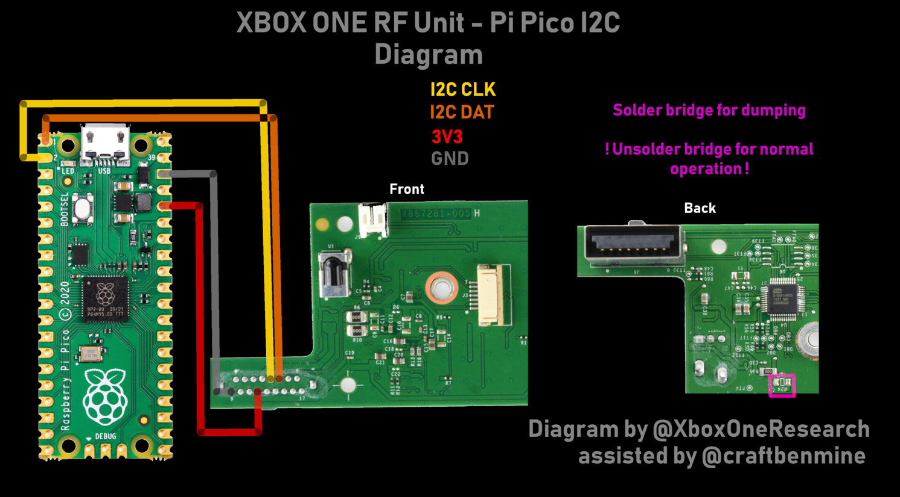

# Durango RF Unit I2C tooling

<Warning>
* Use at your own risk*
</Warning>

Technical infos: <https://xboxoneresearch.github.io/wiki/hardware/rf-unit/>

## Requirements

- (PHAT) RF Unit board

I2C Device clients:
- GreatFET One board
or
- Raspberry Pi (untested)
or
- Micropython device (ESP8266, ESP32, Pi Pico ..)

Depending on the device, pull-up resistors might be necessary.

## Connections

| RF Unit      | Greatfet ONE | RasPi                    | RasPi Pico      | ESP8266     | Notes                            |
| ------------ | ------------ | ------------------------ | --------------- | ----------- |----------------------------------|
| Pin 4  (5V)  | 5V           | 5V                       | 5V              | 5V          |Only necessary for sound playback |
| Pin 12 (3V3) | 3.3V         | 3.3V                     | 3.3V            | 3.3V        |                                  |
| GND 9  (GND) | Any GND      | Any GND                  | Any GND         | Any GND     |                                  |
| Pin 6  (SDA) | SDA (Pin 39) | GPIO2 (I2C1 SDA) - Pin 3 | Pin 1 (GP0)     | GPIO 4      |                                  |
| Pin 5  (SCL) | SCL (Pin 40) | GPIO3 (I2C1 SCL) - Pin 5 | Pin 2 (GP1)     | GPIO 5      |                                  |

### Pi Pico diagram



## Features

- Play sounds
- Dump flash

## Usage

- Solder I2C connections and 5V/3.3V/GND
- Install python requirements, preferrably in a python venv
  - GreatFET: `pip install greatfet`
  - Raspberry Pi (not Pico): `pip install smbus2`
  - Micropython: `pip install pyserial`
- Execute `rfunit.py` (see below for micropython)

### Micropython

Check [Pyboard tool](https://docs.micropython.org/en/latest/reference/pyboard.py.html) for an overview.

Steps:
- Download [pyboard.py](https://github.com/micropython/micropython/blob/master/tools/pyboard.py)
- Make script executable: `chmod +x pyboard.py`
- Identify the serial port where you micropython device got enumerated (via `dmesg`), f.e. `/dev/ttyACM0`
- Execute the script: `./pyboard.py --device /dev/ttyACM0 rfunit.py`
- Copy the dump to the PC: `./pyboard.py --device /dev/ttyACM0 -f cp :dump.bin .`


## Flashdump

Size: 0x24400

Checksum (SHA256)
```
abc699513959372faee038c78a1d7509c2020f65cb78ad07ab9c90b21b406a87  isd_9160f_fullflash.bin
```

Some strings
```
ISD9160FIMS03 FW Jun 14 2013 at 10:41:12 (C) Nuvoton 2013
Nuvoton ISD9160MS Boot FW Jun 14 2013 10:40:21 
ISD-VPE Ver 920.000c 08/05/2013 PV_Prod_Units_Rev5 VERSION:0x10000007
```
