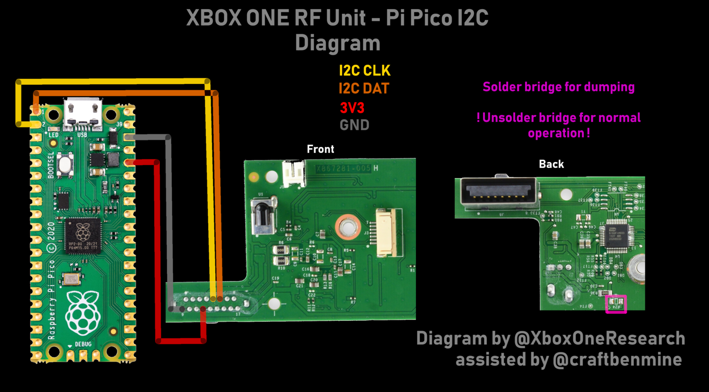
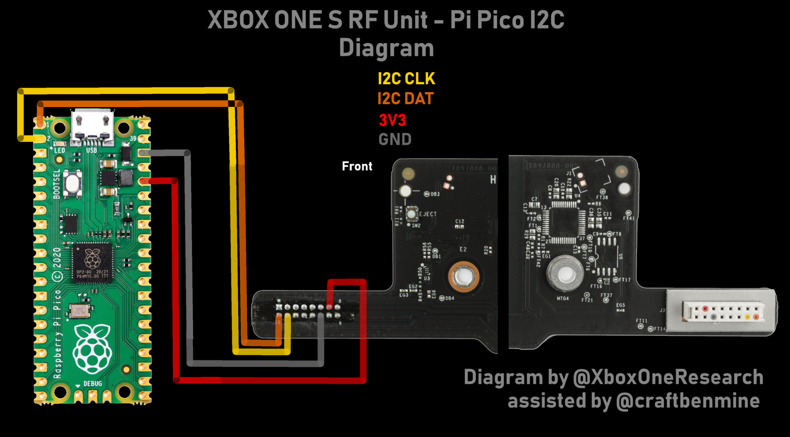
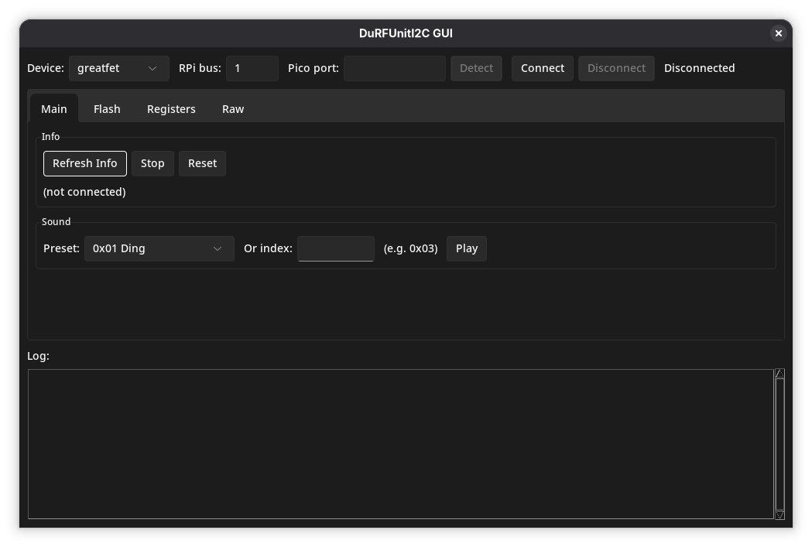
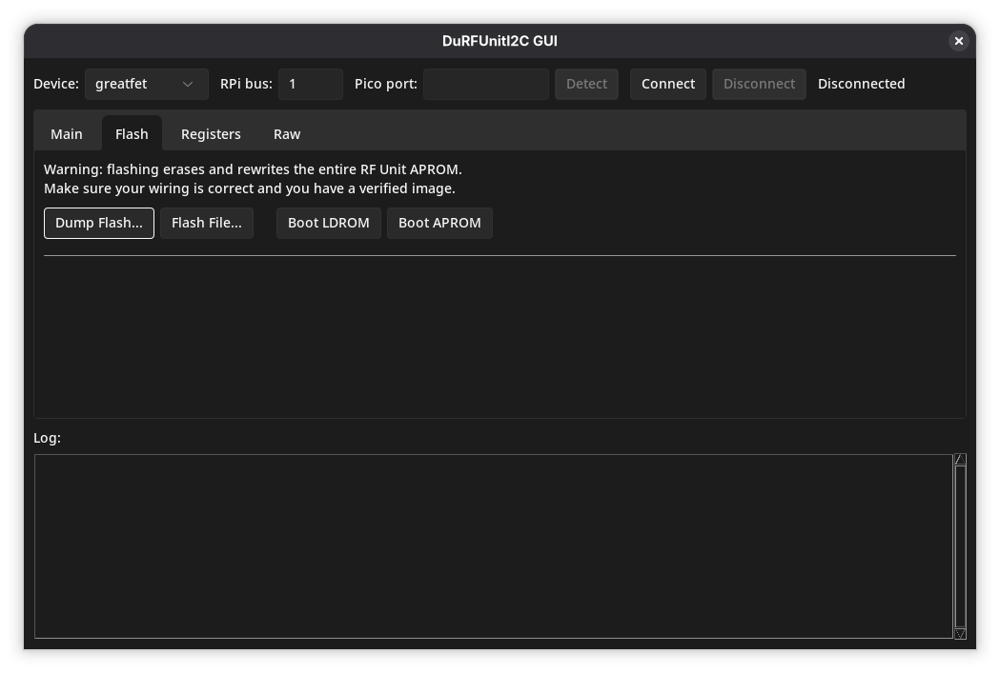
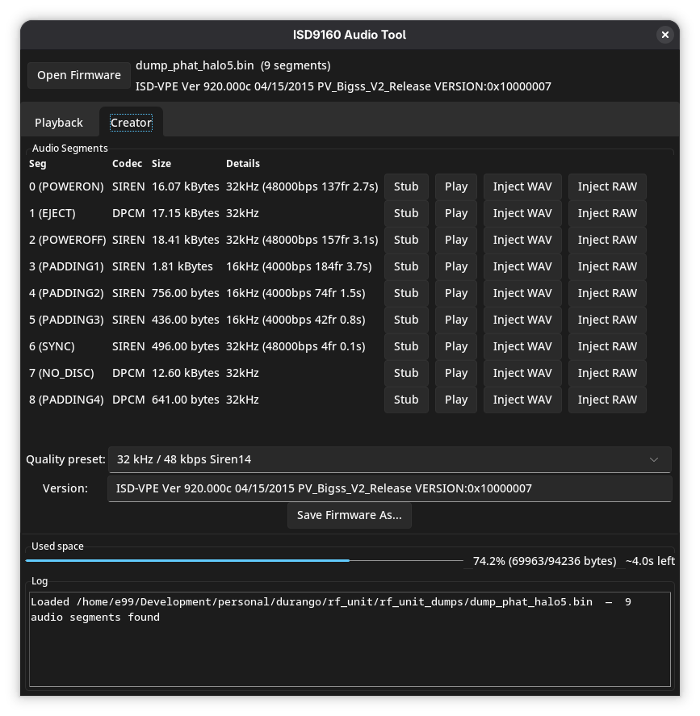

# Durango RF Unit I2C Tooling

[](https://github.com/xboxoneresearch/DuRFUnitI2C/releases/latest)

Tools for Xbox One RF Unit flash dumping, writing, and firmware editing with custom audio.

> [!WARNING]
> Use at your own risk!

> [!IMPORTANT]
> Download the latest release from the [Releases page](https://github.com/xboxoneresearch/DuRFUnitI2C/releases)

**Technical documentation**: [Xbox One RF Unit Hardware](https://xboxoneresearch.github.io/wiki/hardware/rf-unit/)

## Features

- **RFUnit Tool**: Play sounds, dump flash, write flash
- **VPE Tool**: Play sounds from firmware, inject custom audio

## Requirements

**Hardware:**
- Xbox One PHAT or One S RF Unit board

**I2C Interface Device (choose one):**
- GreatFET One board
- Raspberry Pi (non-Pico)
- Micropython device (ESP8266, ESP32, Pi Pico, etc.)

**Software:** (for development)
- uv (Python package manager) - [Install uv](https://docs.astral.sh/uv)
- Python 3.x

## Quick Start

**For Other Devices:**
1. Wire I2C connections (see [Hardware Connections](#hardware-connections) section)
2. Use GUI or CLI tool (see [Usage](#usage) section)

## Hardware Connections

**RF Unit Pin Mapping:**

| Xbox / Pin       | 3V3 | GND | SDA (DATA) | SCL (CLOCK) | Notes                                    |
|------------------|-----|-----|-----------|------------|------------------------------------------|
| RF Unit (PHAT)   | 12  | 9   | 6         | 5          | Solder bridge on R24; remove after use  |
| RF Unit (One S)  | 7   | 11  | 16        | 15         | —                                        |
| FACET (Universal)| NC  | 2   | 26        | 25         | Connector on motherboard; see note below|

**Interface Device Pin Mapping:**

| Board / Pin      | 3V3 | GND | SDA (DATA)           | SCL (CLOCK)         |
|------------------|-----|-----|----------------------|---------------------|
| GreatFET One     | 3V3 | Any | 39                   | 40                  |
| Raspberry Pi     | 3V3 | Any | 3 (GPIO2 / I2C1)     | 5 (GPIO3 / I2C1)    |
| Pi Pico          | 3V3 | Any | 1 (GP0)              | 2 (GP1)             |
| ESP8266          | 3V3 | Any | GPIO 4               | GPIO 5              |

### Direct Xbox Motherboard (FACET) Connections

See [FACET Hardware Documentation](https://xboxoneresearch.github.io/wiki/hardware/facet/)

**Important:**
- DO NOT connect 3V3 power
- DO NOT press the power button
- Solder 300 Ohm resistor between SMC_RST (Pin 1) and GND
- Xbox requires standby power (PSU connected, not powered on)
- Desolder all connections after dumping/flashing

### Reference Diagrams

**Pi Pico Connection - Xbox One PHAT:**


**Pi Pico Connection - Xbox One S:**


## Usage

### Installation

**Option 1: Using Pre-built Binaries**
1. Download the latest [release](https://github.com/xboxoneresearch/DuRFUnitI2C/releases)
2. Extract and run the appropriate executable for your platform

**Option 2: Manual Setup (Development)**
1. Install uv: [https://docs.astral.sh/uv](https://docs.astral.sh/uv)
2. Clone repository: `git clone https://github.com/xboxoneresearch/DuRFUnitI2C.git`
3. Install dependencies: `uv sync`

### RFUnit Tool - GUI

Interactive tool for RF Unit control:
```bash
rfunit-gui
```

**Or manually with uv:**
```bash
uv run rfunit-gui
```

**Device Selection:**
- **GreatFET on Windows**: Select "greatfet"
- **Pi Pico (MicroPython)**: Select "pico" (leave port blank, click Detect)
- **Raspberry Pi (Linux)**: Select "rpi"

**Screenshots:**





### RFUnit Tool - Command Line

For GreatFET or Raspberry Pi:
```bash
rfunit-cli
```

**Or manually:**
```bash
uv run rfunit-cli
```

### RFUnit Tool - MicroPython

For devices running MicroPython (Pi Pico, ESP8266, ESP32):

**Using Pre-built Binary:**
```bash
rfunit-micropython
```

**Manual Method:**

1. Identify serial port: `dmesg | grep ttyACM` (e.g., `/dev/ttyACM0`)
2. Copy flash.bin to device:
   ```bash
   uv run pyboard --device /dev/ttyACM0 -f cp flash.bin :flash.bin
   ```
3. Execute flash/dump:
   ```bash
   uv run pyboard --device /dev/ttyACM0 ./src/rfunit.py
   ```
4. Copy dump back to PC:
   ```bash
   uv run pyboard --device /dev/ttyACM0 -f cp :dump.bin .
   ```

See [Pyboard Tool Documentation](https://docs.micropython.org/en/latest/reference/pyboard.py.html)

### VPE Editor - Audio Tool

Edit audio in ISD9160 firmware files and create custom VPE blobs for Xbox One/S/X button sounds.

**Requirements**: Original firmware file as base

**GUI:**
```bash
vpe-gui
```

**Or manually:**
```bash
uv run vpe-gui
```

**Command Line:**
```bash
vpe-cli
```

**Or manually:**
```bash
uv run vpe-cli
```



## Contributors

Special thanks to:

- [flynnyfoo](https://github.com/FJCFJC123) for audio format decoding and GUI development
- [craftbenmine](https://github.com/craftbenmine) for initial hardware experiments, testing, and suggestions
